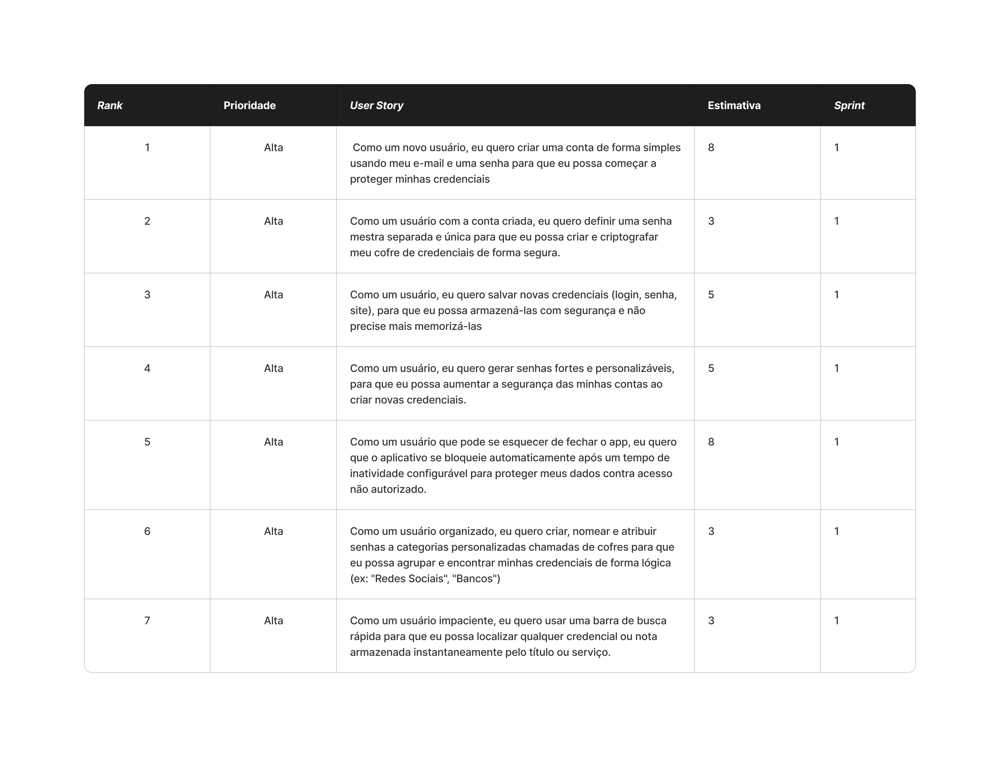

## User Stories realizados nesta sprint 📖

### Critérios de aceitação para cada User Story 📒

Claro! Entendido. Aqui estão os critérios de aceitação para cada uma das suas 7 user stories, seguindo o formato que você especificou.

### **US1: Criar conta de usuário**

- O formulário de criação de conta deve conter os campos:
    - E-mail;
    - Senha;
- O sistema deve validar os campos do formulário:
    - O e-mail deve estar em um formato válido (ex: `usuario@dominio.com`).
    - O e-mail informado não pode já estar cadastrado no sistema.
    - A senha deve ter um requisito mínimo de segurança (ex: 8 caracteres).
- O sistema deve pedir confirmação de e-mail via código OTP
- O sistema deve exibir mensagens de erro claras caso alguma validação falhe.
- Após o sucesso no cadastro, o usuário deve ser redirecionado para a próxima etapa (definir senha mestra).

### **US2: Definir senha mestra**

- O formulário de definição de senha mestra deve conter os campos:
    - Senha Mestra;
    - Confirmação de Senha Mestra.
- Deve ser exibida uma mensagem informativa explicando que a senha mestra não pode ser recuperada e é usada para criptografar o cofre.
- O sistema deve validar os campos do formulário:
    - A senha mestra deve ser numérica de 8 digitos.
- Após a definição com sucesso, o cofre de credenciais do usuário deve ser criado e o usuário deve ser levado à tela principal do aplicativo (itens criados por ele).

### **US3: Salvar novas credenciais**

- O formulário para salvar uma nova credencial deve conter os campos:
    - Título / Nome do Serviço (campo obrigatório);
    - Login / Nome de usuário;
    - Senha;
    - Site / URL (campo opcional);
    - Notas (campo opcional).
- Ao salvar, a nova credencial deve ser adicionada à lista de credenciais do usuário.
- Todas as informações da credencial devem ser armazenadas de forma criptografada no banco de dados.

### **US4: Gerar senhas fortes**

- Dentro do formulário de adição/edição de credenciais, deve haver um botão ou ícone para "Gerar Senha".
- Ao clicar em gerar, deve ser exibida uma interface com opções de personalização:
    - Comprimento da senha (slider ou campo numérico);
    - Incluir letras maiúsculas (checkbox);
    - Incluir letras minúsculas (checkbox);
    - Incluir números (checkbox);
    - Incluir símbolos (checkbox).
- O campo de senha do formulário deve ser preenchido automaticamente com a senha gerada.
- Deve haver um botão para copiar a senha gerada para a área de transferência.

### **US5: Bloqueio automático por inatividade**

- Deve existir uma área nas configurações do aplicativo onde o usuário possa definir o tempo para o bloqueio automático (ex: 1 min, 5 min, 10 min).
- Se o aplicativo não registrar nenhuma interação do usuário durante o tempo configurado, ele deve ser bloqueado.
- Uma vez bloqueado, o usuário deve ser obrigado a inserir sua senha mestra para acessar o cofre novamente.
- O contador de inatividade deve ser reiniciado sempre que o usuário interagir com o aplicativo.

### **US6: Organizar credenciais em categorias (cofres)**

- O usuário deve poder criar novas categorias (cofres) informando um nome para elas.
- No formulário de adição/edição de credencial, deve haver um campo (ex: menu suspenso) para atribuir a credencial a um cofre existente.
- Na tela principal, as credenciais devem poder ser visualizadas ou filtradas por cofre.
- O usuário deve poder renomear ou excluir um cofre.
- O usário deve poder escolher um cofre para visualizar seus itens através de um menu lateral.

### **US7: Buscar credenciais**

- A tela principal do cofre deve exibir uma barra de busca.
- A lista de credenciais deve ser filtrada em tempo real à medida que o usuário digita na barra de busca.
- A busca deve considerar o "Título / Nome do Serviço" da credencial.
- A busca não deve diferenciar letras maiúsculas de minúsculas (deve ser case-insensitive).
- Se a busca não retornar nenhum resultado, uma mensagem clara como "Nenhum resultado encontrado" deve ser exibida.