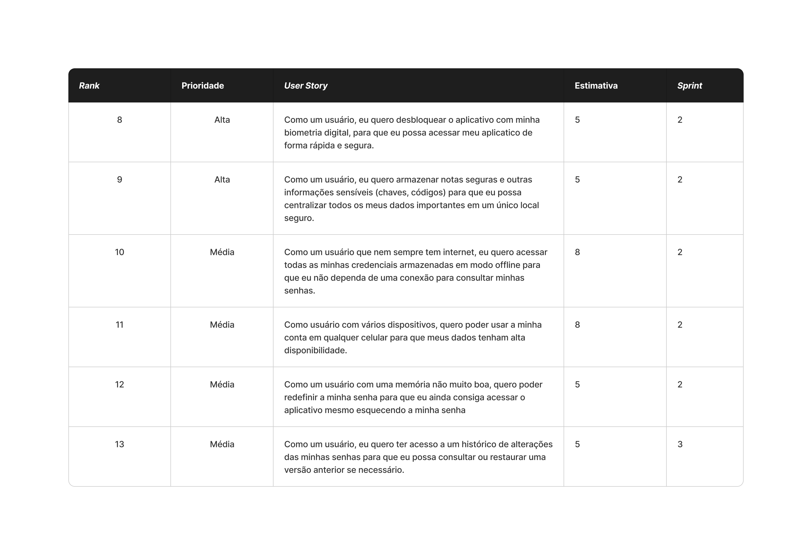

## User Stories realizados nesta sprint 📖

### Critérios de aceitação para cada User Story 📒

### **US8: Desbloqueio com biometria**

  - O usuário deve poder habilitar ou desabilitar o desbloqueio por biometria (impressão digital ou reconhecimento facial) na tela de "Configurações" do aplicativo.
  - Ao habilitar, o sistema deve primeiro solicitar a senha mestra do usuário como confirmação.
  - O aplicativo deve solicitar a permissão do sistema operacional para usar os recursos biométricos.
  - Na próxima vez que o aplicativo for iniciado ou sair do estado de "bloqueio automático", ele deve prioritariamente solicitar a autenticação biométrica.
  - Em caso de sucesso na autenticação biométrica, o cofre é desbloqueado e o usuário acessa seus itens.
  - Caso a autenticação biométrica falhe (ex: 3 tentativas) ou seja cancelada pelo usuário, o aplicativo deve solicitar a senha mestra como método alternativo.

### **US9: Armazenar notas seguras**

  - O usuário deve ter a opção de criar um novo tipo de item no cofre, chamado "Nota Segura" (além das "Credenciais").
  - O formulário para uma nova nota deve conter, no mínimo, um campo de "Título" e um campo de "Conteúdo" (texto livre, multi-linhas).
  - Todo o conteúdo da nota segura deve ser armazenado de forma criptografada no banco de dados, utilizando a chave derivada da senha mestra.
  - As notas seguras devem ser listadas na tela principal (ou em uma categoria/filtro "Notas") e ser identificáveis (ex: por um ícone diferente).
  - O usuário deve poder visualizar, editar e excluir notas seguras existentes.

### **US10: Acesso em modo offline**

  - O aplicativo deve manter uma cópia local (cache) do cofre do usuário, armazenada de forma criptografada no dispositivo.
  - O usuário deve conseguir abrir o aplicativo e desbloquear o cofre (usando senha mestra ou biometria) mesmo quando o dispositivo estiver sem conexão com a internet.
  - Uma vez desbloqueado em modo offline, o usuário deve poder visualizar, pesquisar e copiar todas as credenciais e notas já sincronizadas.
  - (Opcional, mas recomendado) O usuário deve poder criar, editar ou excluir itens em modo offline. Essas alterações devem ser enfileiradas e sincronizadas com o servidor assim que a conexão for restabelecida.
  - O aplicativo deve indicar visualmente (ex: um ícone ou banner) quando estiver operando em modo offline e/Oou quando houver alterações pendentes de sincronização.

### **US11: Sincronização entre dispositivos**

  - Ao fazer login em um novo dispositivo, o aplicativo deve baixar com segurança o cofre criptografado do servidor e descriptografá-lo localmente usando a senha mestra.
  - Qualquer item (credencial ou nota) criado ou editado no "Dispositivo A" deve ser sincronizado com o servidor e, subsequentemente, aparecer no "Dispositivo B" assim que este estiver online.
  - Qualquer item excluído no "Dispositivo A" deve ser removido do "Dispositivo B" após a sincronização.
  - O processo de sincronização deve ocorrer automaticamente em segundo plano sempre que o aplicativo estiver aberto e online, sem a necessidade de intervenção manual do usuário.
  - O sistema deve ser capaz de lidar com edições concorrentes (embora a estratégia exata, como "última escrita vence", possa ser definida à parte).

### **US12: Recuperação de senha da conta**

  - Na tela de login do aplicativo, deve haver um link ou botão "Esqueci minha senha".
  - Este fluxo se refere à **senha da conta** (usada para login, definida na US1) e **não** à **senha mestra** (usada para criptografia, definida na US2).
  - Ao clicar, o usuário deve ser solicitado a informar seu e-mail de cadastro.
  - Se o e-mail for válido, o sistema deve enviar um e-mail contendo um link ou código de redefinição de senha com tempo de expiração.
  - Ao seguir as instruções do e-mail, o usuário deve ser capaz de definir uma nova senha de conta.
  - Uma nota de aviso clara deve informar ao usuário que este processo *não* recupera a senha mestra e que, se a senha mestra for perdida, o acesso aos dados do cofre será permanentemente perdido.