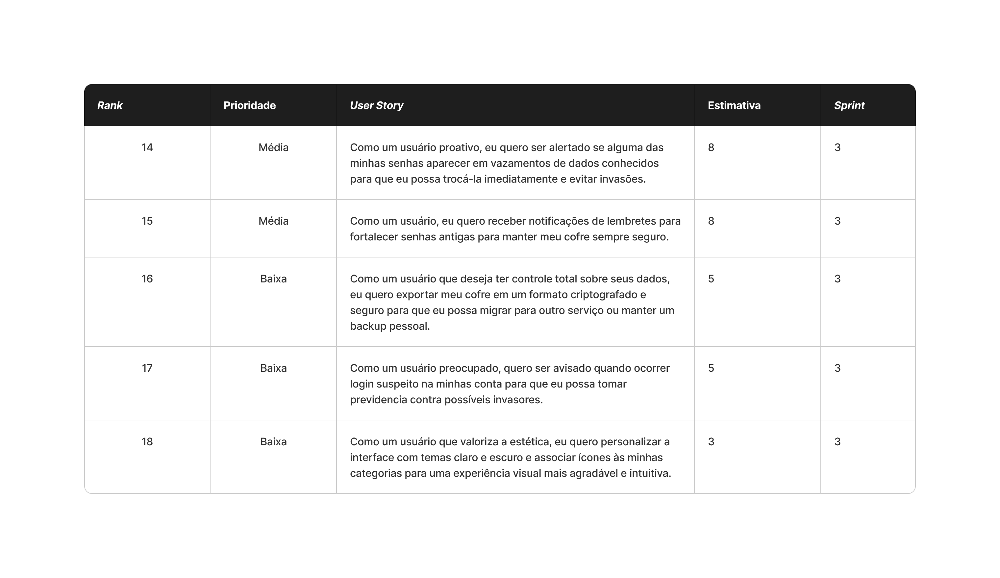

Com base na imagem fornecida e seguindo o modelo do relatório da Sprint 2, aqui está o relatório da **Sprint 3** formatado:

## User Stories realizados nesta sprint 📖

\

### Critérios de aceitação para cada User Story 📒

### **US14: Alerta de vazamento de dados**

  - O sistema deve verificar periodicamente (ou sob demanda) se as senhas armazenadas aparecem em bancos de dados de vazamentos conhecidos (ex: integração com API *Have I Been Pwned*).
  - A verificação deve garantir a privacidade do usuário (ex: enviando apenas parte do hash da senha/k-anonymity).
  - Caso uma senha seja encontrada em um vazamento, o item correspondente no cofre deve exibir um ícone de alerta ou etiqueta de "Comprometida".
  - O usuário deve receber uma notificação (push ou in-app) informando que uma ou mais senhas foram expostas.
  - Ao clicar no alerta, o usuário deve ser direcionado para a tela de edição da credencial para realizar a troca imediata.

### **US15: Lembretes de renovação de senha**

  - O sistema deve rastrear a data da última alteração de cada senha armazenada.
  - O usuário deve poder configurar (ou o sistema ter um padrão, ex: 90 ou 180 dias) o intervalo de tempo para considerar uma senha "antiga".
  - O aplicativo deve enviar uma notificação lembrando o usuário de atualizar senhas que excederam esse tempo.
  - Deve haver uma seção ou filtro no cofre para visualizar rapidamente quais senhas precisam de renovação.
  - O usuário deve ter a opção de "ignorar" o lembrete para credenciais específicas que não deseja alterar.

### **US16: Exportação segura do cofre**

  - Na tela de configurações, deve haver uma opção "Exportar Cofre".
  - O sistema deve exigir a confirmação da **senha mestra** antes de iniciar o processo de exportação.
  - O usuário deve poder escolher um formato de exportação (ex: JSON ou CSV).
  - O arquivo exportado deve ser gerado de forma criptografada, exigindo que o usuário defina uma senha específica para abrir/descriptografar este arquivo de backup.
  - O sistema deve alertar claramente sobre os riscos de segurança ao manusear o arquivo exportado.

### **US17: Alerta de login suspeito**

  - O sistema backend deve monitorar metadados de acesso, como Endereço IP, localização aproximada e tipo de dispositivo.
  - Caso um login seja realizado de um novo dispositivo ou localização desconhecida, o sistema deve disparar um e-mail ou notificação push para o usuário.
  - O alerta deve conter detalhes do acesso: Data/Hora, IP, Localização e Dispositivo.
  - O alerta deve fornecer um link ou botão de ação rápida "Não fui eu", que permite ao usuário bloquear temporariamente a conta ou forçar a redefinição da senha da conta.

### **US18: Personalização de interface (Temas e Ícones)**

  - O usuário deve ter acesso a uma configuração de "Aparência" ou "Temas".
  - Deve ser possível alternar entre "Modo Claro", "Modo Escuro" ou "Seguir padrão do sistema". A interface deve reagir instantaneamente à mudança.
  - Na criação ou edição de categorias (pastas), o usuário deve poder selecionar um ícone visual a partir de uma biblioteca pré-definida.
  - Os ícones escolhidos devem ser exibidos nas listas de itens, facilitando a identificação visual rápida das categorias.